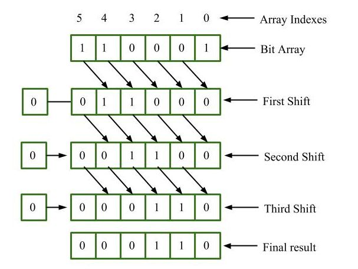

# Übung 4 - Messwertverlauf

## Aufgabenstellung

Schreibe ein Programm, welches immer einen analogen Wert über den Pin A4 einliest. Dieser Wert wird in die lokale `int` Variable `voltage` gespeichert.

Ebenso wird der Wert in eine `int` Liste `voltage_history` gespeichert. Diese Liste kann maximal 10 Werte speichern.

Ist der letzte freie Platz in der Liste vergeben, so wird die gesamte Liste um eine Stelle verschoben.

Der Wert der 10. Stelle wird in Platz der akutellen 9. Stelle geschrieben.
Der Wert der 9. Stelle wird in den Platz der akutellen 8. Stelle geschrieben.
Dies wird fortgeführt bis zur letzten Stelle.
Der freigewordene 10. Platz wird mit dem Wert von `voltage` beschrieben.

Am Ende von jedem Durchlauf sollen alle Werte der Liste nacheinander ausgegeben werden.
Zuletzt wird noch zwei Sekunden gewartet bis der nächste Durchlauf startet.

Die Beschaltung des Arduino wird als korrekt angenommen.
